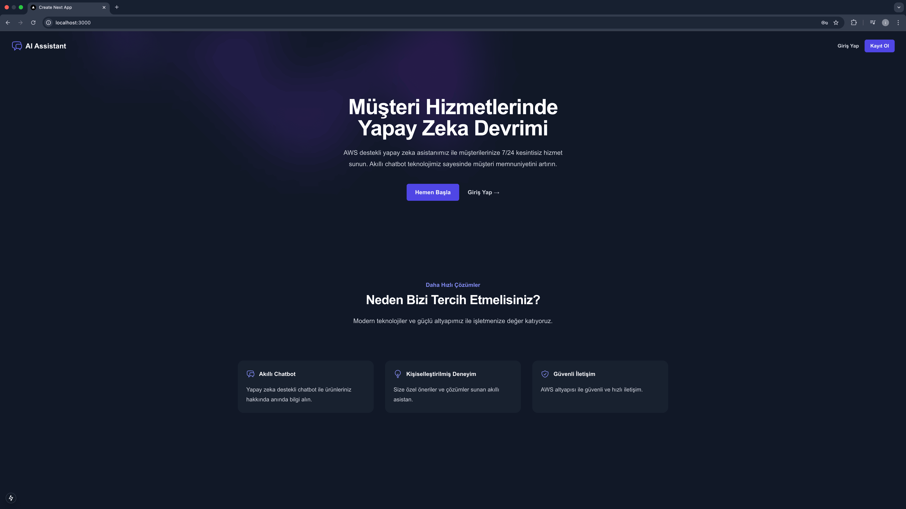

# 🤖 Customer Service AI Assistant

  
  
  
  
  

 

## 📋 Proje Hakkında

Bu proje, yapay zeka destekli bir müşteri hizmetleri asistanı uygulamasıdır. Modern web teknolojileri ve AWS serverless mimarisi kullanılarak geliştirilmiştir. Kullanıcıların sorularını gerçek zamanlı olarak yanıtlayarak müşteri hizmetleri süreçlerini otomatikleştirir.

### 🌟 Öne Çıkan Özellikler

- ⚡ **Gerçek Zamanlı Sohbet**: Anında yanıt veren interaktif sohbet arayüzü
- 🧠 **Yapay Zeka Desteği**: Gelişmiş AI modelleri ile doğal dil işleme
- 🔐 **Güvenli Kimlik Doğrulama**: Kullanıcı hesapları ve oturum yönetimi
- 📊 **Sohbet Geçmişi**: Önceki konuşmaları görüntüleme ve devam ettirme

## 🏗️ Mimari

Proje iki ana bileşenden oluşmaktadır:

### Frontend
- **Next.js**: React tabanlı modern web framework
- **TypeScript**: Tip güvenliği sağlayan JavaScript süper kümesi
- **Tailwind CSS**: Hızlı UI geliştirme için utility-first CSS framework
- **React**: Kullanıcı arayüzü için komponent tabanlı JavaScript kütüphanesi

### Backend
- **AWS Lambda**: Serverless fonksiyon çalıştırma ortamı
- **API Gateway**: RESTful API endpoint yönetimi
- **S3**: Dosya depolama ve statik içerik sunumu
- **Node.js**: Sunucu tarafı JavaScript runtime

## 🖼️ Ekran Görüntüleri

  
  
<i>Ana Sayfa - Müşteri Hizmetlerinde Yapay Zeka Devrimi</i>

## 📝 Kullanım

1. Ana sayfada kullanıcı girişi yapın veya yeni hesap oluşturun
2. Sohbet arayüzünde müşteri hizmetleri asistanına sorunuzu yazın
3. Gerçek zamanlı yanıtları alın ve konuşmaya devam edin
4. Geçmiş sohbetlerinize istediğiniz zaman erişebilirsiniz

## 👨‍💻 Geliştirici Bilgileri

Bu proje, AWS serverless mimarisi ve modern web teknolojileri konusunda deneyim kazanmak amacıyla geliştirilmiştir. Projenin amacı, müşteri hizmetleri süreçlerini otomatikleştirerek hem kullanıcı deneyimini iyileştirmek hem de işletmelere maliyet avantajı sağlamaktır.

## 🔄 CI/CD Pipeline

Projemiz, sürekli entegrasyon ve sürekli dağıtım (CI/CD) prensiplerini takip etmektedir. Bu, kod kalitesini artırmak ve dağıtım sürecini otomatikleştirmek için tasarlanmıştır.

### 🔧 CI Pipeline

- **GitHub Actions**: Her pull request ve main branch'e push işleminde otomatik olarak çalışır
- **Linting**: ESLint ve Prettier ile kod kalitesi ve stil kontrolü
- **Unit Testler**: Jest ile otomatik birim testleri
- **Integration Testler**: End-to-end testler için Cypress kullanımı

### 📦 CD Pipeline

- **Otomatik Deployment**: Main branch'e merge edilen değişiklikler otomatik olarak staging ortamına deploy edilir
- **AWS Deployment**: AWS CDK kullanılarak AWS kaynaklarının otomatik oluşturulması ve güncellenmesi
- **Frontend Deployment**: Vercel platformu üzerinden otomatik frontend deployment
- **Backend Deployment**: AWS Lambda ve API Gateway için otomatik deployment

### 🔍 Kalite Kontrol

- **Code Review**: Tüm pull request'ler en az bir onay gerektirir
- **Test Coverage**: %80 ve üzeri test coverage hedefi
- **Security Scanning**: Güvenlik açıklarını tespit etmek için otomatik tarama

## 🔒 Güvenlik Notları

- `.env` dosyaları repository'ye dahil edilmemiştir
- Hassas bilgiler için `.env.example` dosyaları şablon olarak kullanılmıştır
- AWS kaynaklarına erişim için IAM rol tabanlı yetkilendirme kullanılmıştır
- Kullanıcı kimlik bilgileri güvenli bir şekilde saklanmaktadır

